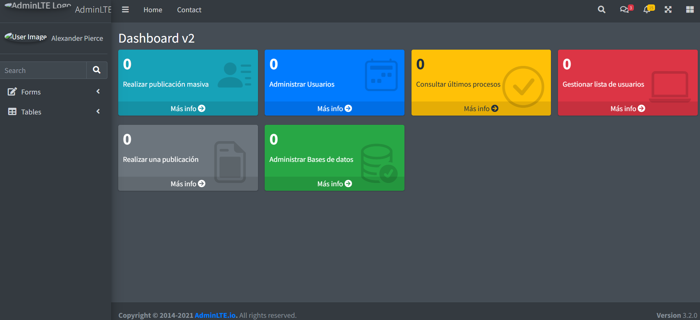

# AdminLTE + Angular Integration
## actual version on 20.3.1
Este proyecto integra **AdminLTE** con **Angular** para crear un sistema de administración moderno y dinámico.

## 📋 Descripción

AdminLTE es una plantilla de administración de código abierto basada en Bootstrap 4/5. En este proyecto, hemos integrado AdminLTE con Angular para aprovechar la modularidad y dinamismo que ofrece Angular junto con el diseño atractivo de AdminLTE.

## 🚀 Características

- **Diseño Moderno**: Interfaz visualmente atractiva proporcionada por AdminLTE.
- **Modularidad de Angular**: Componentes y rutas reutilizables.
- **SPA (Single Page Application)**: Navegación rápida sin recargar la página.
- **Personalización Fácil**: Edición de estilos, temas y estructura.

## 🛠️ Requisitos Previos

Asegúrate de tener instalados los siguientes programas antes de empezar:

- **Node.js**: >= v14
- **Angular CLI**: >= v15
- **Git*#
-----------------------------
###### Github Pages
- elimina la carpeta dist
```
ng add angular-cli-ghpages 
ng build --configuration production --base-href=/Angular_adminlte/
ng deploy --base-href=https://jose-daniel-g.github.io/Angular_adminlte/
```
https://jose-daniel-g.github.io/angular-link-votes-app/



